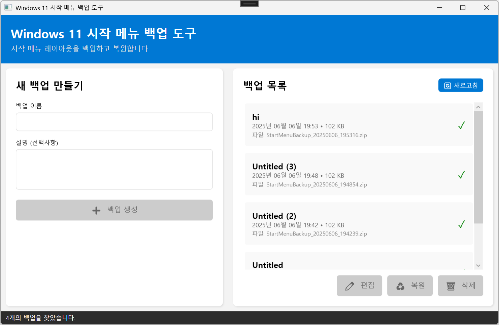
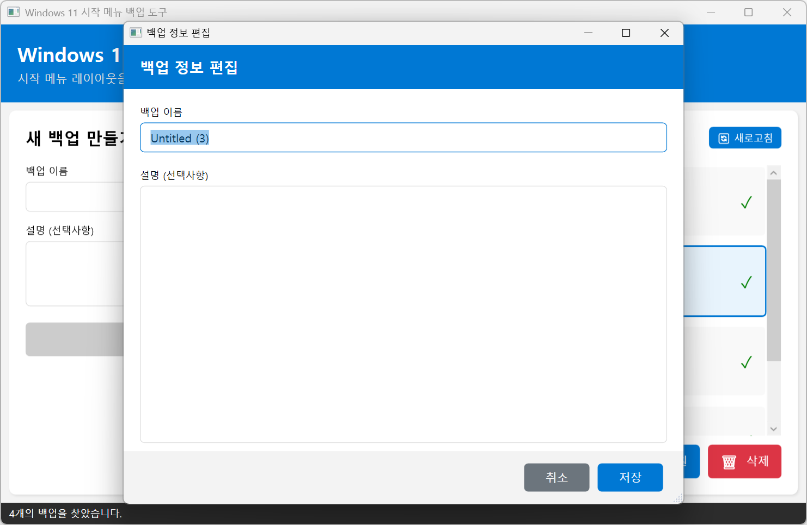
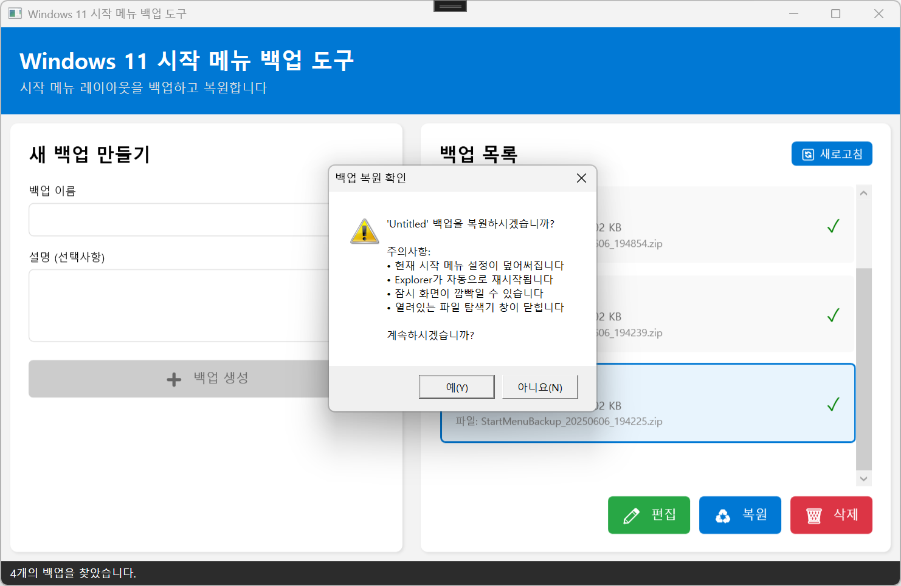

# Windows 11 시작 메뉴 백업 도구 (StartMenuBackupTool)

<div align="center">
  
  
  [](https://dotnet.microsoft.com/)
  [](https://docs.microsoft.com/en-us/dotnet/desktop/wpf/)
  [](https://www.microsoft.com/windows)
</div>

## 📋 개요

Windows 11 시작 메뉴 백업 도구는 Windows 11의 시작 메뉴 레이아웃과 설정을 백업하고 복원할 수 있는 WPF 애플리케이션입니다. 시스템 재설치나 설정 이전 시 유용하게 사용할 수 있습니다.

### 주요 기능

- ✅ **시작 메뉴 백업**: Windows 11 시작 메뉴 레이아웃을 ZIP 파일로 백업
- ♻️ **백업 복원**: 저장된 백업에서 시작 메뉴 설정 복원
- 📝 **백업 관리**: 백업 이름 및 설명 편집
- 🔄 **즉시 적용**: Explorer 자동 재시작으로 변경사항 즉시 반영
- 🎨 **모던 UI**: Windows 11 스타일의 깔끔한 인터페이스

## 🖼️ 스크린샷

### 메인 화면


*백업 생성 및 관리가 가능한 메인 인터페이스*

### 백업 편집


*백업 이름과 설명을 수정할 수 있는 편집 다이얼로그*

### 백업 복원


*백업 복원 전 확인 다이얼로그*

## 🚀 시작하기

### 시스템 요구사항

- Windows 11
- .NET 8.0 Runtime
- 관리자 권한

### 설치 방법

1. 최신 릴리즈에서 실행 파일 다운로드
2. 관리자 권한으로 실행
3. 첫 실행 시 관리자 권한 요청 승인

### 빌드 방법

```bash
# 저장소 클론
git clone https://github.com/yourusername/StartMenuBackupTool.git

# 프로젝트 디렉토리로 이동
cd StartMenuBackupTool/StartMenuBackupTool

# 빌드
dotnet build

# 실행
dotnet run
```

## 📁 프로젝트 구조

```
StartMenuBackupTool/
├── StartMenuBackupTool/
│   ├── Commands/
│   │   └── RelayCommand.cs          # ICommand 구현
│   ├── Helpers/
│   │   ├── Converters.cs            # XAML 값 변환기
│   │   └── PathHelper.cs            # 경로 관리 헬퍼
│   ├── Models/
│   │   └── BackupInfo.cs            # 백업 정보 모델
│   ├── Services/
│   │   └── StartMenuBackupService.cs # 백업/복원 비즈니스 로직
│   ├── ViewModels/
│   │   ├── BaseViewModel.cs         # ViewModel 기본 클래스
│   │   └── MainViewModel.cs         # 메인 화면 ViewModel
│   ├── Views/
│   │   ├── EditBackupDialog.xaml    # 백업 편집 다이얼로그
│   │   └── EditBackupDialog.xaml.cs # 백업 편집 코드비하인드
│   ├── App.xaml                     # 애플리케이션 진입점
│   ├── App.xaml.cs
│   ├── MainWindow.xaml              # 메인 윈도우 UI
│   ├── MainWindow.xaml.cs           # 메인 윈도우 코드비하인드
│   ├── app.manifest                 # 관리자 권한 매니페스트
│   └── StartMenuBackupTool.csproj   # 프로젝트 파일
├── .gitignore
├── README.md
└── StartMenuBackupTool.sln          # 솔루션 파일
```

## 🏗️ 아키텍처

### MVVM 패턴
- **Model**: 백업 데이터 및 비즈니스 로직
- **View**: XAML 기반 UI
- **ViewModel**: View와 Model 간의 데이터 바인딩 및 명령 처리

### 주요 기술 스택
- **Framework**: .NET 8.0, WPF
- **패턴**: MVVM (Model-View-ViewModel)
- **언어**: C# 12.0
- **UI**: XAML, Modern Windows 11 Design

## 💡 사용 방법

### 백업 생성
1. 백업 이름 입력
2. 설명 추가 (선택사항)
3. "백업 생성" 버튼 클릭

### 백업 복원
1. 백업 목록에서 복원할 백업 선택
2. "복원" 버튼 클릭
3. 확인 다이얼로그에서 "예" 선택
4. Explorer가 자동으로 재시작되며 변경사항 적용

### 백업 편집
1. 백업 목록에서 편집할 백업 선택
2. "편집" 버튼 클릭 또는 더블클릭
3. 이름과 설명 수정
4. "저장" 버튼 클릭

## 🔒 보안 및 권한

- **관리자 권한 필요**: 시스템 파일 접근을 위해 관리자 권한으로 실행
- **백업 위치**: `문서\StartMenuBackups` 폴더에 안전하게 저장
- **데이터 무결성**: ZIP 압축 및 메타데이터로 백업 관리

## 📝 개발 노트

### 백업 대상 경로
```csharp
// Windows 11 시작 메뉴 레이아웃 데이터
%LocalAppData%\Packages\Microsoft.Windows.StartMenuExperienceHost_cw5n1h2txyewy\LocalState

// 시작 메뉴 타일 데이터베이스
%LocalAppData%\Microsoft\Windows\Shell
```

### Explorer 재시작 로직
백업 복원 후 자동으로 Explorer.exe를 재시작하여 변경사항을 즉시 적용합니다.

## 🙏 감사의 말

- Windows 11 디자인 가이드라인
- .NET 커뮤니티
- WPF MVVM 패턴 가이드

## 📞 문의

프로젝트 관련 문의사항이 있으시면 Issues 탭을 이용해 주세요.

---

<div align="center">
  Made with ❤️ for Windows 11 users
</div> 